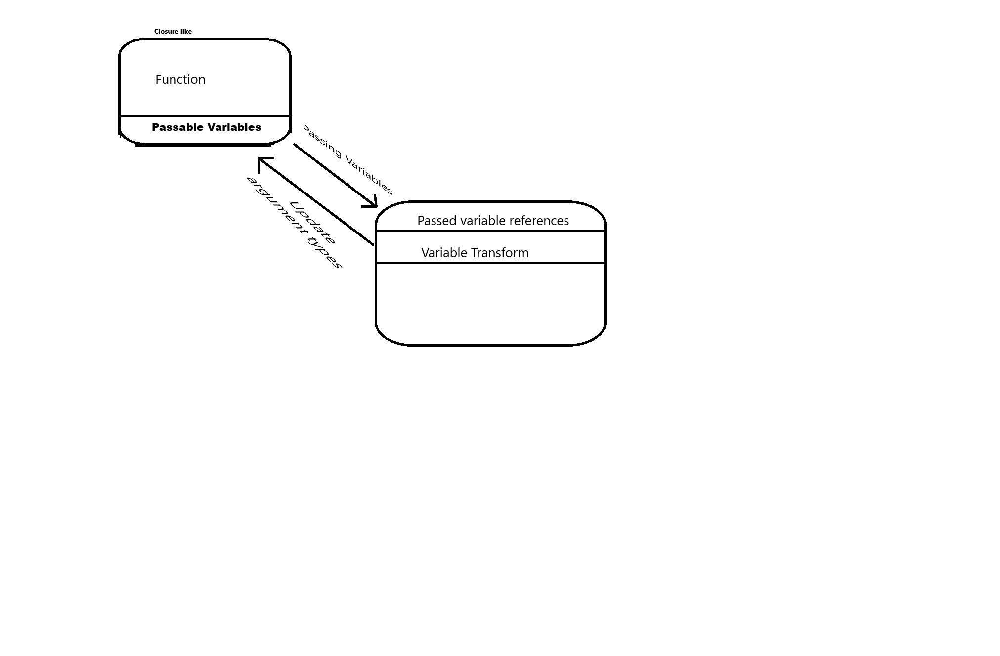

# Purpose

To serve as a module for interface with a given python function using inspect and functools.

The functions being interfaced with must either have argument annotation \( any unannotated arguments will defualt to type string and must be parsed Accordingly \) and return None.


```python
def function(arg1:'type1', arg2:'type2', ..., kwargA:'typeA'=a, kwargB:'typeB'=b, ..., *args, **kwargs):
    # Transform arguments
    ...
    # ensure Return None
    return None
```

I am still figuring out how to deal with default arguments.

Options load them and check for entry. This an issue if we want to preserve empty strings. Although it is okay if we place another constarint that functions must deal with empty string translation.
We use empty entries as `None` this is slightly easier to work with but leaves a lot to be desired in differnentiating `None` and `''`. 
We could also create a wrapper class for `str` so its interfacable much the same but allows a check to see if its not set or just an emptystring. Although not perfect as this requires function feedback which will be optional as it causes a bit of overhead. Also this only works because strings are imutable.



It should rezemble the above diagram.

this may allow for calling from other commands and event_listeners but we will see.